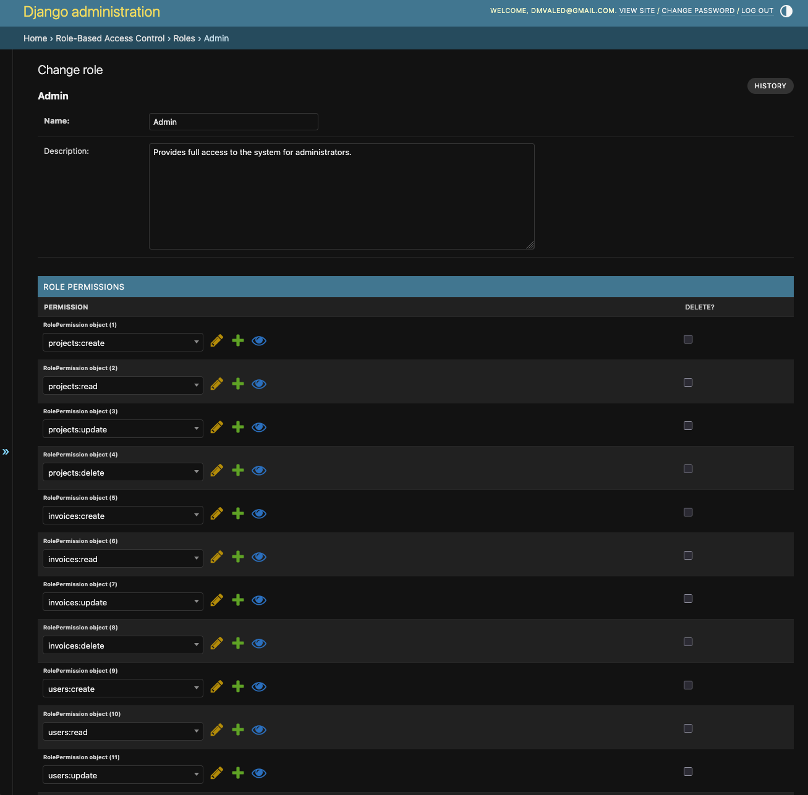

# AuthGuard: Secure Authentication & RBAC API


AuthGuard is a robust, production-ready backend system built with Django and Django REST Framework. It provides a
complete solution for user authentication, authorization, and advanced permission management through a powerful,
custom-built Role-Based Access Control (RBAC) system.

The project is designed to serve as the secure foundation for any modern web application, mobile app, or microservice
architecture. It features a clean, well-documented API and follows best practices for security, scalability, and
maintainability.

## Key Features

This system is more than just a login page. It's a comprehensive security and user management solution.

- **Custom User Model**: Uses email as the primary identifier for authentication, replacing the default username.
- **Token-Based Authentication**: Secure, stateless API authentication using JSON Web Tokens (JWT) via
  django-rest-framework-simplejwt.
- **Secure Logout (Token Blacklisting)**: Implements a token blacklist to ensure JWTs are properly invalidated upon
  logout, enhancing security.
- **Role-Based Access Control (RBAC)**:
    - A granular, database-driven permission system.
    - Admins can define Resources (e.g., "projects"), Actions (e.g., "read"), and combine them into Permissions (e.g., "
      projects:read").
    - Permissions are bundled into Roles (e.g., "Admin", "Project Manager", "Viewer").
    - Users are assigned Roles to grant them specific access rights across the application.
- **Automated Role Assignment**:
    - Uses Django Signals to automatically assign a "Default" role to new users.
    - Automatically assigns the "Admin" role to any user promoted to a superuser, keeping Django's auth and the RBAC
      system in sync.
- **User Lifecycle Management**:
    - **Soft Delete**: Users can safely "delete" their own accounts, which deactivates them but preserves their data.
    - **Permanent Delete**: A secure, admin-only endpoint to permanently erase a user from the database.
    - **Restore**: Admins can easily restore soft-deleted users.
- **Professional API with Documentation**:
    - Clean, intuitive, and RESTful API design.
    - Automatically generated, interactive API documentation via drf-spectacular (Swagger UI & ReDoc).
    - Separate, secure endpoints for user profile management vs. administrative actions.
- **Custom Django Admin**:
    - A highly customized admin interface for managing users, roles, and permissions.
    - Uses inlines to make assigning roles to users and permissions to roles simple and intuitive.
    - Custom admin actions for soft-deleting and restoring users.
- **Initial Data Seeding**: Includes a Django data migration to automatically bootstrap the entire RBAC system with
  foundational roles, permissions, and actions on a fresh database setup.

# Схема управления доступом (RBAC)

Для управления правами доступа в системе используется гибкая и масштабируемая модель Role-Based Access Control (RBAC).
Эта модель позволяет детально определять, какие действия и над какими ресурсами может выполнять конкретный пользователь.
Архитектура построена на нескольких ключевых таблицах в базе данных, которые работают совместно для реализации правил
доступа.

## Компоненты схемы базы данных

Ниже описаны основные таблицы, составляющие систему RBAC, и их назначение.

### 1. Resource (Ресурс)

**Назначение**: Определяет защищаемые сущности системы. Ресурс представляет ключевой компонент приложения (например, "
Проекты", "Счета", "Пользователи").

**Поля**: `id`, `code` (уникальный код, например `projects`), `description`.

**Пример**: Ресурс с кодом `invoices` представляет все данные и операции, связанные со счетами.

### 2. Action (Действие)

**Назначение**: Определяет возможные операции над ресурсами. Это глаголы, описывающие действия (например, "читать", "
создавать", "удалять").

**Поля**: `id`, `code` (уникальный код, например `read`), `description`.

**Пример**: Действие с кодом `delete` представляет операцию удаления.

### 3. Permission (Разрешение)

**Назначение**: Атомарное правило доступа, связывающее Ресурс с Действием. Формирует конкретное право (например, "читать
проекты" или "удалять счета").

**Поля**: `id`, `resource_id` (внешний ключ к Resource), `action_id` (внешний ключ к Action).

**Пример**: Связь ресурса `projects` и действия `read` представляет разрешение `projects:read`.

### 4. Role (Роль)

**Назначение**: Логическая группа или "должность" в системе, объединяющая набор Разрешений. Определяет функциональные
обязанности (например, "Администратор", "Менеджер проектов", "Пользователь").

**Поля**: `id`, `name` (уникальное имя, например `Admin`), `description`.

**Пример**: Роль "Менеджер проектов" может включать разрешения `projects:read`, `projects:create` и `projects:update`.

### 5. RolePermission (Связь "Роль-Разрешение")

**Назначение**: Промежуточная таблица (связь "многие-ко-многим"), связывающая Роли с Разрешениями.

**Поля**: `id`, `role_id` (внешний ключ к Role), `permission_id` (внешний ключ к Permission).

**Пример**: Связь роли `Admin` с разрешением `projects:delete` означает, что администраторы могут удалять проекты.

### 6. UserRole (Связь "Пользователь-Роль")

**Назначение**: Промежуточная таблица (связь "многие-ко-многим"), назначающая Роли пользователям.

**Поля**: `id`, `user_id` (внешний ключ к User), `role_id` (внешний ключ к Role).

**Пример**: Связь пользователя `user@example.com` с ролью `Project Manager` означает, что пользователь является
менеджером проектов.

## Схема управления ограничениями доступа

Процесс проверки прав доступа работает по следующему алгоритму:

1. **Аутентификация**: Пользователь входит в систему, его сессия идентифицируется (например, через JWT-токен)

2. **Сбор ролей**: Система находит все записи в таблице UserRole, связанные с текущим пользователем, для определения его
   ролей

3. **Сбор разрешений**: Для каждой роли пользователя система через таблицу RolePermission находит все связанные
   разрешения

4. **Формирование прав**: Все уникальные разрешения формируют полный список прав пользователя (например,
   `['projects:read', 'invoices:read']`). Список кешируется на время запроса

5. **Проверка доступа**: При попытке выполнения действия система проверяет, требует ли endpoint определенного разрешения

6. **Принятие решения**: Если требуемое разрешение присутствует в списке прав - доступ разрешается. В противном случае
   возвращается ошибка 403 Forbidden

Такая декомпозированная структура позволяет гибко управлять доступом, создавая любые комбинации прав и назначая их
пользователям через интуитивно понятные роли без изменения кода приложения.

## Getting Started

### Prerequisites

- Python 3.12+
- Poetry (or pip with requirements.txt)

### Installation & Setup

1. **Clone the repository**:
    ```bash
    git clone https://github.com/valed-dm/authsys.git
    cd authsys
    ```

2. **Install dependencies**:
    ```bash
    # Using Poetry
    poetry install

    ```

3. **Set up environment variables**:
   Create a `.env` file in the project root and add your configuration:
    ```env
    DJANGO_SECRET_KEY=dev-secret-change-later-for-production
    JWT_SECRET=super-secret-change-me
    JWT_ALG=HS256
    # 15 min
    JWT_ACCESS_TTL=900
    # 30 days
    JWT_REFRESH_TTL=2592000
    ```

4. **Run database migrations**:
   This will create all the necessary tables, including the custom User model and the RBAC system. It will also run the
   data migration to seed initial roles and permissions.
    ```bash
    python manage.py migrate
    ```

5. **Create a superuser**:
   This will create an initial admin account. The signal system will automatically assign this user the "Admin" role in
   the RBAC system.
    ```bash
    python manage.py createsuperuser
    ```

6. **Run the development server**:
    ```bash
    python manage.py runserver
    ```

The application will now be running at `http://127.0.0.1:8000/`.

- **API Docs**: http://127.0.0.1:8000/api/docs/
- **Django Admin**: http://127.0.0.1:8000/admin/

## API Endpoint Reference

This provides a high-level overview of the available API endpoints. For detailed request/response schemas, please use
the Swagger UI.

### Authentication (`/api/accounts/`)

- **POST** `/register/` - Register a new user account
- **POST** `/login/` - Authenticate and receive JWT tokens
- **POST** `/token/refresh/` - Refresh expired access tokens

### User Profile (`/api/accounts/me/`)

- **GET**, **PATCH** `/me/` - Retrieve or update current user profile
- **GET** `/me/permissions/` - Get current user's permissions
- **POST** `/me/delete/` - Soft delete current user account

### Admin: User Management (`/api/accounts/`)

- **GET**, **POST** `/users/` - List all users or create new user (Admin only)
- **GET**, **PATCH** `/users/{id}/` - Retrieve or update specific user (Admin only)
- **POST** `/users/{id}/assign-role/` - Assign role to user (Admin only)
- **DELETE** `/users/{id}/delete/` - Permanently delete user (Admin only)

### Admin: RBAC Management (`/api/rbac/`)

- **GET**, **POST** `/roles/` - List all roles or create new role (Admin only)
- **GET**, **PATCH**, **DELETE** `/roles/{id}/` - Retrieve, update, or delete specific role (Admin only)
- **POST** `/roles/{id}/assign-permission/` - Assign permission to role (Admin only)

### Example Endpoints (`/api/mock/`)

- **GET** `/projects/` - Requires `projects:read` permission
- **POST** `/orders/create/` - Requires `invoices:create` permission

## License

This project is licensed under the MIT License. See the LICENSE file for details.

# Project URL Reference

This document provides a comprehensive overview of all major URL endpoints available in the application, including the
web interface, the Django Admin, and the APIs.

## 1. Web Interface (`accounts_html`)

These are the user-facing HTML pages for authentication and profile management.

| URL Path               | View Name        | URL Name                  | Description                                                       |
|------------------------|------------------|---------------------------|-------------------------------------------------------------------|
| `/`                    | HomePageView     | `home`                    | The main landing page. Redirects to login or profile.             |
| `/accounts/register/`  | RegisterPageView | `accounts_html:register`  | Page for new users to sign up.                                    |
| `/accounts/login/`     | LoginPageView    | `accounts_html:login`     | Page for users to log in.                                         |
| `/accounts/logout/`    | LogoutPageView   | `accounts_html:logout`    | Logs the user out.                                                |
| `/accounts/me/`        | MeView           | `accounts_html:me`        | User's main account management page (update profile, etc.).       |
| `/accounts/me/delete/` | DeleteMeView     | `accounts_html:delete_me` | Handles the POST request to soft-delete a user's account.         |
| `/accounts/profile/`   | ProfilePageView  | `accounts_html:profile`   | User's public-facing profile page (deprecated or same as `/me/`). |

**Correction Note**: The distinction between `/accounts/me/` and `/accounts/profile/` seems redundant. It's recommended
to consolidate these into a single, primary account page (`/me/` is a good modern choice).

## 2. API Endpoints (`accounts_api`, `rbac_api`, `mockapi`)

These are the primary API endpoints. For a detailed interactive reference, see the Swagger UI.

### 2.1. Authentication & User Management (`accounts_api`)

| URL Path                                | View Name                  | URL Name                                 | Description                                       |
|-----------------------------------------|----------------------------|------------------------------------------|---------------------------------------------------|
| `/api/accounts/register/`               | RegisterAPIView            | `accounts_api:register_api`              | POST: Create a new user account.                  |
| `/api/accounts/login/`                  | LoginAPIView               | `accounts_api:login_api`                 | POST: Authenticate and get JWT tokens.            |
| `/api/accounts/token/refresh/`          | TokenRefreshView           | `accounts_api:token-refresh`             | POST: Get a new access token.                     |
| `/api/accounts/me/`                     | ProfileAPIView             | `accounts_api:profile_api`               | GET, PATCH: View or update your own profile.      |
| `/api/accounts/me/permissions/`         | MyPermissionsAPIView       | `accounts_api:my_permissions_api`        | GET: View your own detailed permissions.          |
| `/api/accounts/me/delete/`              | SoftDeleteMeAPIView        | `accounts_api:soft_delete_me_api`        | POST: Soft-delete your own account.               |
| `/api/accounts/users/`                  | UserViewSet                | `accounts_api:user-list`                 | GET, POST: Admin list or create users.            |
| `/api/accounts/users/{id}/`             | UserViewSet                | `accounts_api:user-detail`               | GET, PATCH: Admin view or update a specific user. |
| `/api/accounts/users/{id}/assign-role/` | UserViewSet                | `accounts_api:user-assign-role`          | POST: Admin assigns a role to a user.             |
| `/api/accounts/users/{id}/delete/`      | PermanentDeleteUserAPIView | `accounts_api:permanent_delete_user_api` | DELETE: Admin permanently deletes a user.         |
| `/api/accounts/users/superusers/`       | SuperuserListAPIView       | `accounts_api:superusers_list_api`       | GET: Admin lists all superusers.                  |
| `/api/accounts/deleted/`                | DeletedUsersListAPIView    | `accounts_api:deleted_users`             | GET: Admin lists all soft-deleted users.          |
| `/api/accounts/deleted/{id}/restore/`   | RestoreUserAPIView         | `accounts_api:restore_user`              | POST: Admin restores a soft-deleted user.         |

### 2.2. Role-Based Access Control (`rbac_api`)

| URL Path                                  | View Name         | URL Name                          | Description                                               |
|-------------------------------------------|-------------------|-----------------------------------|-----------------------------------------------------------|
| `/api/rbac/roles/`                        | RoleViewSet       | `rbac_api:role-list`              | GET, POST: Admin list or create roles.                    |
| `/api/rbac/roles/{id}/`                   | RoleViewSet       | `rbac_api:role-detail`            | GET, PATCH, DELETE: Admin view, update, or delete a role. |
| `/api/rbac/roles/{id}/assign-permission/` | RoleViewSet       | `rbac_api:role-assign-permission` | POST: Admin assigns a permission to a role.               |
| `/api/rbac/permissions/`                  | PermissionViewSet | `rbac_api:permission-list`        | GET: Admin lists all available permissions.               |
| `/api/rbac/resources/`                    | ResourceViewSet   | `rbac_api:resource-list`          | GET: Admin lists all available resources.                 |
| `/api/rbac/actions/`                      | ActionViewSet     | `rbac_api:action-list`            | GET: Admin lists all available actions.                   |

### 2.3. Mock Endpoints (`mockapi`)

| URL Path                          | View Name         | URL Name                  | Description                                |
|-----------------------------------|-------------------|---------------------------|--------------------------------------------|
| `/api/mock/projects/`             | ProjectListView   | `mockapi:projects-list`   | GET: Mock endpoint to list projects.       |
| `/api/mock/projects/create/`      | ProjectCreateView | `mockapi:projects-create` | POST: Mock endpoint to create a project.   |
| `/api/mock/projects/{id}/delete/` | ProjectDeleteView | `mockapi:projects-delete` | DELETE: Mock endpoint to delete a project. |
| `/api/mock/orders/`               | OrderListView     | `mockapi:orders-list`     | GET: Mock endpoint to list orders.         |
| `/api/mock/orders/create/`        | OrderCreateView   | `mockapi:orders-create`   | POST: Mock endpoint to create an order.    |
| `/api/mock/orders/{id}/delete/`   | OrderDeleteView   | `mockapi:orders-delete`   | DELETE: Mock endpoint to delete an order.  |

[]()

[]()

[]()

[]()

[]()

[]()

[]()

[]()

[]()

[]()

[]()

[]()

[]()

[]()

[]()

[]()

[]()

[]()
